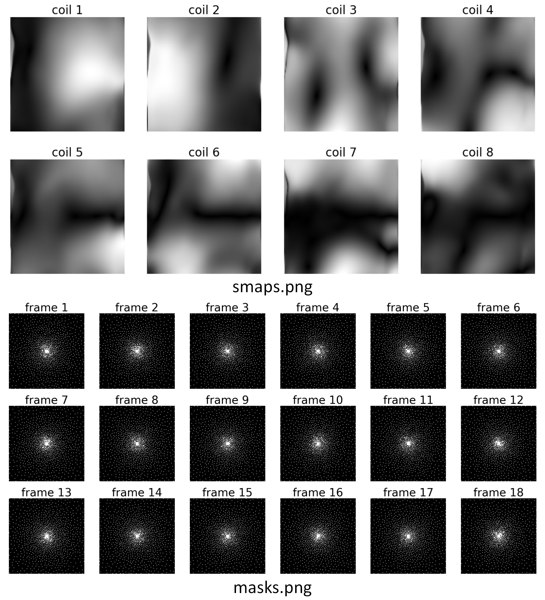
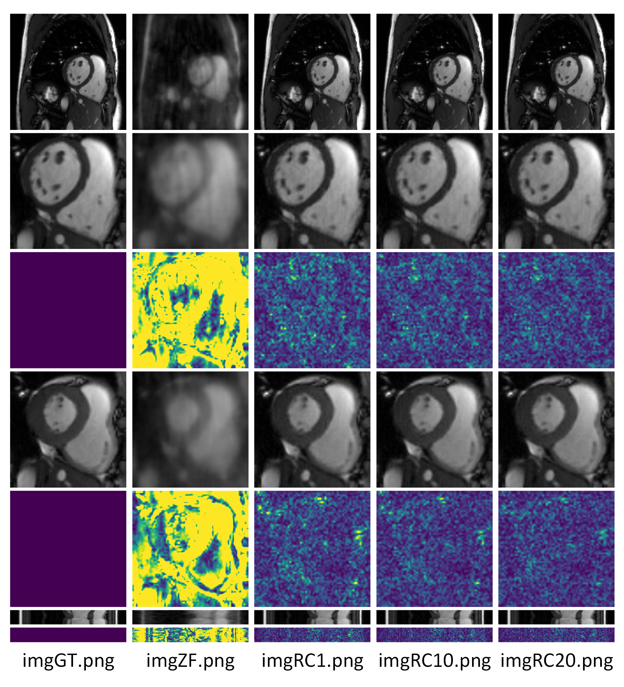

# GIP_Cardiac_MRI
A simple implementation of the GIP method: "Graph Image Prior for Unsupervised Dynamic MRI Reconstruction".

The Network Architecture:


The Optimization Algorithm:


# Environment Configuration
The following environmental configurations can reproduce the results in the article. Other configurations may also be feasible but have not been attempted.

* python=3.8.19
* numpy=1.24.3
* pytorch=1.12.1
* scipy=1.10.1
* matplotlib=3.7.5
* scikit-image=0.21.0
* torchkbnufft=1.4.0
  
The supporting file `environment.txt` is provided for a quick configuration for the necessary packages.

# Contents
* "data/": the dynamic cine MRI data directory. Each data contains a fully-sampled image 'img' and the corresponding estimated sensitivity maps 'smap'
* "mask/": the undersampling pattern directory, containing the undersampling mask (for Cartesian-sampled k-space patterns) or trajectory and the corresponding density compensation funtion (for non-Cartesian-sampled k-space patterns)
* utils.py: the helper functions and classes
* model.py: the Graph-Image_Prior (GIP) generator architecture
* GIP_xxx____pretrain.py: the code for pretraining the generator, using xxx trajectory sampling
* GIP_xxx____ADMM.py: the code of the ADMM algorithm for alternately optimizing the generator and the dynamic images, using xxx trajectory sampling
* GIP_xxx____main.py: a one-click script for running the code to reproduce the results, using xxx trajectory sampling

# Updated Information for Pretraining

Pretraining is critical for producing good reconstruction performance. However, this part has been omitted in the article due to page limit. A brief explanation about the pretraining process is given here.

The GIP generator has two parts: the independent CNNs (G<sub>1</sub>, ..., G<sub>N</sub>) and the GCN network. In this implementation, (G<sub>1</sub>, ..., G<sub>N</sub>) are abbreviated as "G", and the GCN is abbreviated as "C".

We adopted a 3-stage pretraining strategy for the GIP generator.

* First-stage: we add an additional convolution layer at the end of "G", which directly transforms the feature frames to image frames (by reducing the channel numbers to 2). This additional convolution layer is only used for this pretraining stage. The "G" part of the generator with the additional convolution layer are trained by fitting the undersampled k-space data. The aim of this step is to find a good initialization for "G".
* Second-stage: the weights of "G" is kept fixed. The fixed "G" is used jointly with "C" to output the reconstructed images, and then fitting the undersampled k-space data. Because the weights of "G" is fixed, the purpose of this step is to find a good initialization for "C".
* Third-stage: "G" and "C" are used in combination, and the weights of both parts are learnable. Still, fine-tuning is performed by fitting the undersampled k-space data. A detail of this stage is that the graph structure is learnable at the beginning of this stage, but will be fixed after a given iteration number. This graph-structure is also utilized for the following ADMM algorithm.

# A Simple Reconstruction Example for Poisson Sampling
Just run the following command to train a GIP model and perform reconstruction from the very beginning (from randomly-initialized model weight).

```bash
python GIP_Poisson____main.py
```

The pretraining takes 2~3 hours and the ADMM algorithm takes ~1 hour (accordig to the reproduction on a RTX 4090 GPU).

When the code-runing is finished, two additional directories (`GIP_Poisson_R16.0_ACS6x6/` and `output_Poisson/`) should be created:

```bash
├── GIP_Poisson_R16.0_ACS6x6/
│   ├── fs_0032_3T_slc1_p3/
│   │   ├── ADMM/
│   │   ├── C/
│   │   ├── G/
│   │   ├── tune/
│   │   ├── z.h5
├── output_Poisson/
│   ├── imgGT.png
│   ├── imgRC1.png
│   ├── imgRC10.png
│   ├── imgRC20.png
│   ├── imgZF.png
│   ├── masks.png
│   ├── smaps.png
```
* The `GIP_Poisson_R16.0_ACS6x6/` directory contains the intermediate and final results of the GIP reconstruction procedure.
* The `output_Poisson` directory contains the plotted figures of the reconstructed images.
* __IMPORTANT__   Because the `nn.Upsample` module has unavoidable randomness (even if all the random seeds have been controlled, and the torch backends has been kept as deterministic, see [here](https://discuss.pytorch.org/t/non-deterministic-behavior-of-pytorch-upsample-interpolate/42842/6)), the reproduction results may be slightly different. However, we have conducted repeated experiments to ensure that this implementation could lead to relatively stable results. The output images in the `output_Poisson` directory should be similar to the following results:





An example of the reproduction can be downloaded by this link: https://drive.google.com/drive/folders/1auUZusxgkh0ERYF9O0yTh3aR4Wa8rSp1?usp=sharing.

# References
* This work is now an Arxiv preprint at https://arxiv.org/abs/2403.15770.
* If you find this repo helpful, please cite this work as follows:
```bibtex
@article{li2024graph,
  title={Graph Image Prior for Unsupervised Dynamic MRI Reconstruction},
  author={Li, Zhongsen and Chen, Wenxuan and Wang, Shuai and Liu, Chuyu and Li, Rui},
  journal={arXiv preprint arXiv:2403.15770},
  year={2024}
}
```
