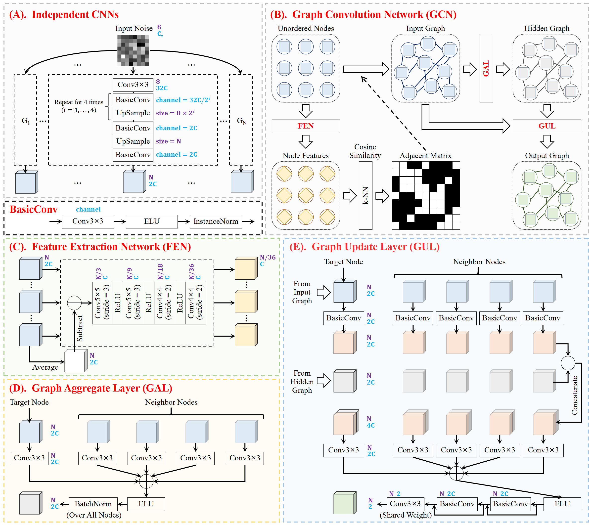
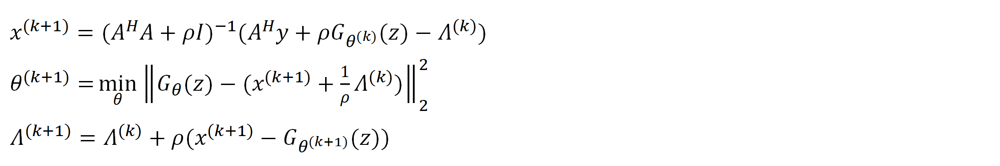

# GIP_Cardiac_MRI
The implementation of "Graph Image Prior for Unsupervised Dynamic MRI Reconstruction"

The Network Architecture:

The Optimization Algorithm:

# Contents

# Reconstruction Demo

# Reconstruction Demo (for Non-Cartesian Trajectories)
* This part will be made available upon publication of the article.

# Requirements
The library versions are validated to reproduce the results, but they are not mandatory.
* PyTorch = 1.12.1
* numpy = 1.24.3
* torchkbnufft = 1.4.0
* scipy = 1.10.1
* scikit-image = 0.19.3
* matplotlib = 3.7.2

# References
